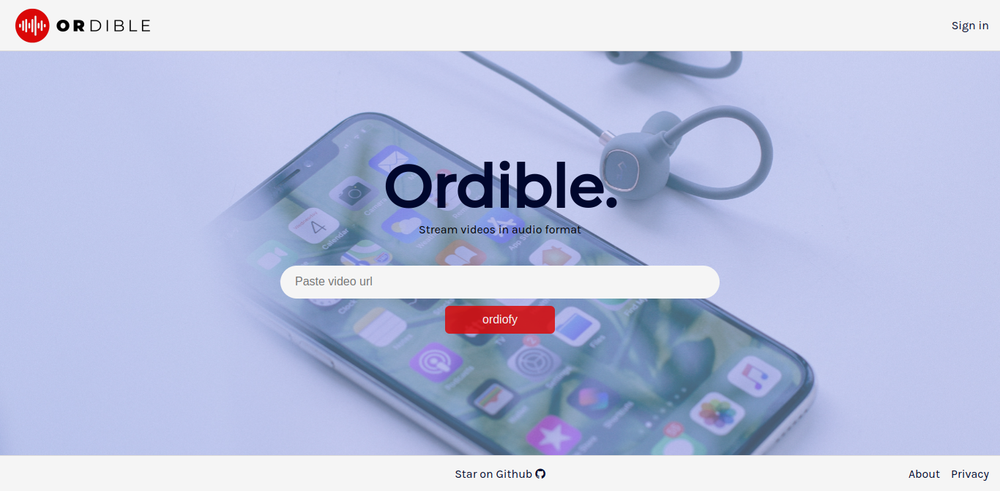
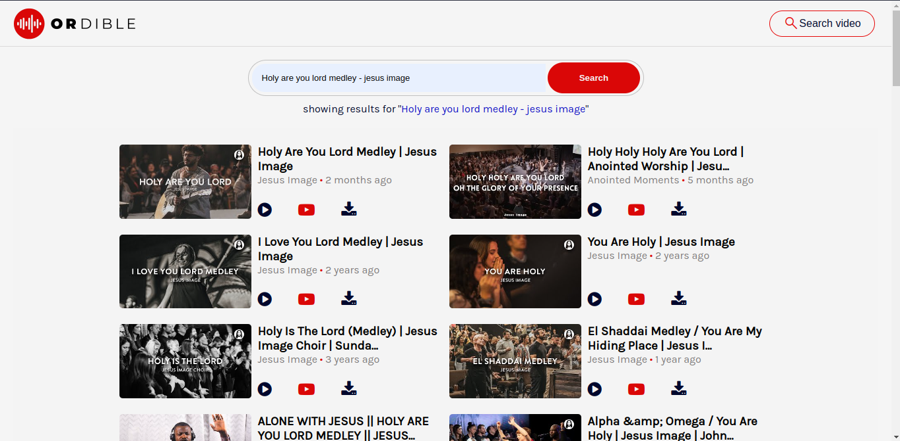
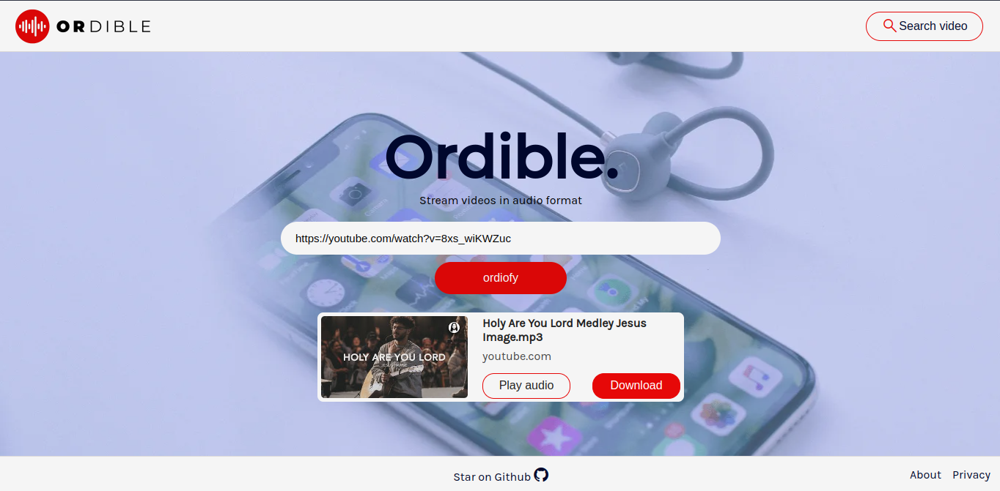
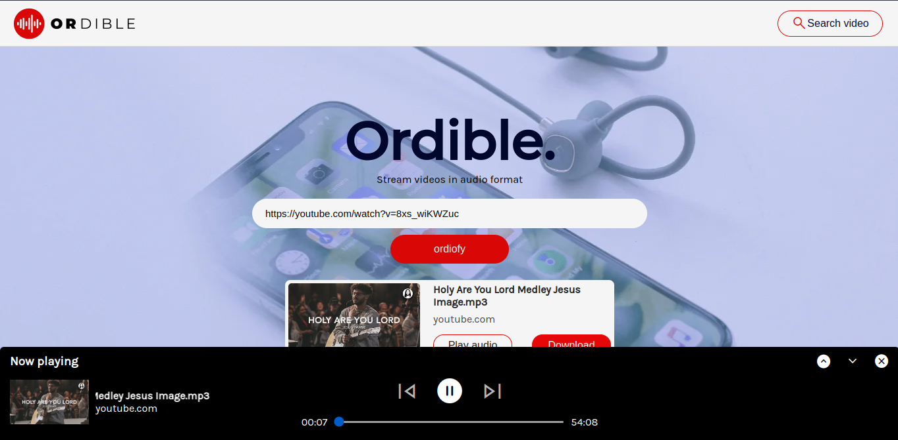
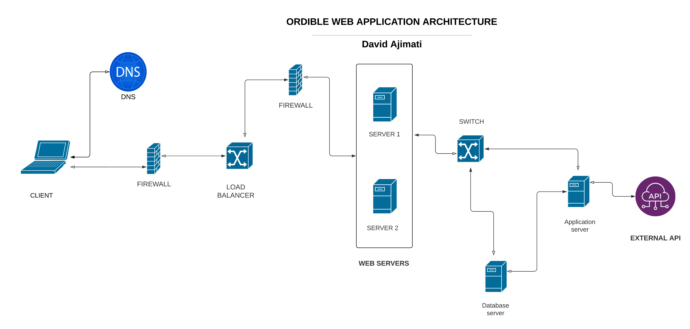

# ORDIBLE

Ordible helps users to stream video contents in audio format from over 700 social media domains 

for a live view, visit: https://ordible.matis.tech
for a static view of the project, visit the github page via: https://davidajimati.github.io/ordible-webapp/index.html
## LIVE PROJECT IMAGES:
- 
Home Page
   
- 
Search Page
   
- 
Home page results
   
- 
Mini Music player Interface
   
- 
Search-page full screen music player
   

## TECHNOLOGIES
- Javascript
- node.js
- express.js
- Vanilla HTML & CSS
- Github
- Youtube API
- youtube-dl-exec
- googleapis
- cors
- ffmpeg ( but reserved for later releases)

## CHALLENGE
Ordible will help users:
- listen to video content in audio format across social networks with less data.
- convert video and provide download options
- play the audio files without saving it locally
- search for video contents from YouTube

## ATTRIBUTES
- consumes API effectively to give users a seamless experience.
- fully mobile responsive
- web music player streams directly from the server
- the server converts the videos only once, then serves it multiple time to the clients
- the server clears the downloaded audios after 60 minutes to maximize memory.
- conversion time may vary, depending on the
## ARCHITECTURE

## DATA MODEL

## APIS
#### YOUTUBE
- youtube Data API -> `https://www.googleapis.com/youtube/v3`

## WIREFRAMES
#### Homepage wireframe

#### Search results page wireframe

## AUTHOR:
 - David M. Ajimati

 
©ORDIBLE - 2023
