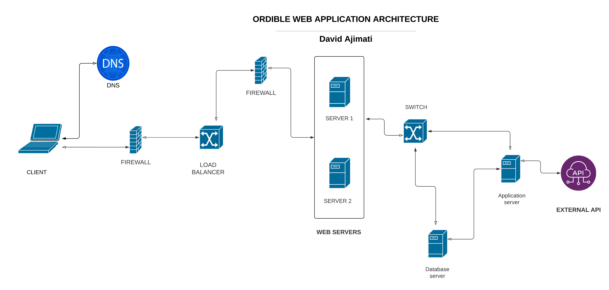

# ORDIBLE
Web app that allows users to stream video content from social media platforms in audio format.

## TECHNOLOGIES
- Bootstrap
- Flask
- Jquery
- Javascript
- HTML & CSS
- Jinja
- Github
- Facebook API
- Youtube API, etc.

### 2 alternate technology choices
- PHP
- Tailwind CSS

## CHALLENGE

- It will help users listen to video content across social networks with less data.
- The app will not give access to copyrighted videos.
- The app can be used by anyone, especially those who listen to some of the audiobooks on youtube and play music videos.
- The app will be available for everyone across the globe since it is web-based.

## ARCHITECTURE

## DATA MODEL

## APIS
### YOUTUBE
`https://www.googleapis.com/youtube/v3`
 - `GET` /videos - Returns a list of videos that match the API request parameters.
 - `GET` /playlists	 - Returns a collection of playlists that match the API request parameters.
 - `GET` /playlistItems	- Returns a collection of playlist items that match the API request parameters.

### FACEBOOK API
**Example**: `https://graph.facebook.com/v12.0/search?q={search-query}&type=video&ccess_token={your-access-token}`

`GET` /v17.0/{video-id} HTTP/1.1
`Host`: graph.facebook.com
`Title` - The video title or caption.
`Source` - A URL to the raw, playable video file.
`Length` - Duration of this video in seconds.
`Is_reference_only` - Whether the video is exclusively used for copyright monitoring

### INSTAGRAM API
Uses the Facebook Graph API
Example:
`GET /me/media?fields=id,caption,media_type,media_url,thumbnail_url&acces_token={ your-access-token}`

## MOCKUPS
#### Homepage Mockup

#### Search results page Mockup

## AUTHORS
 - David M. Ajimati
 - Stanley Paul
